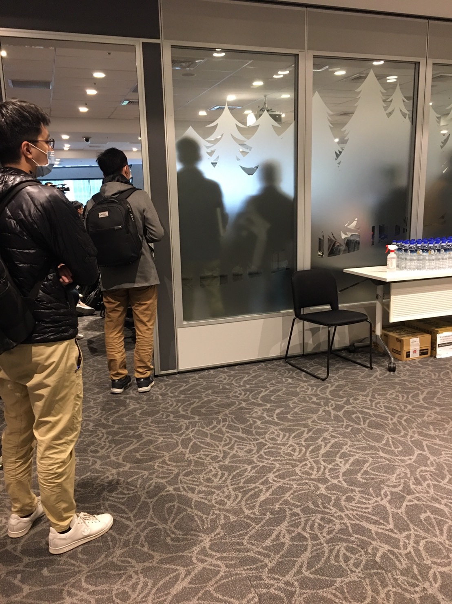
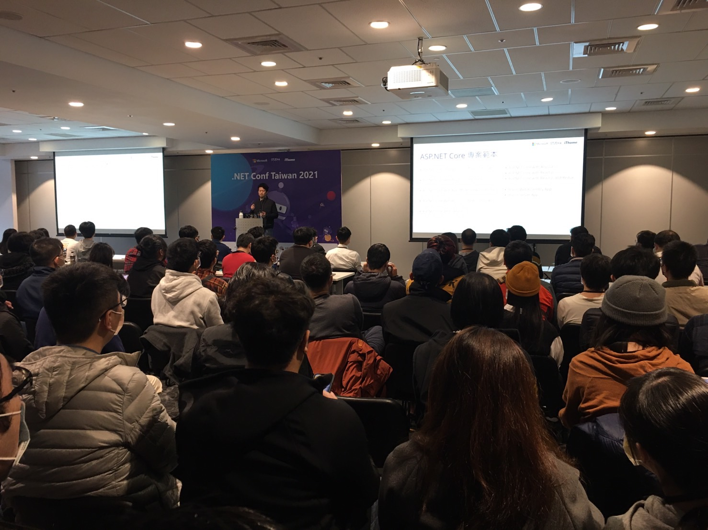
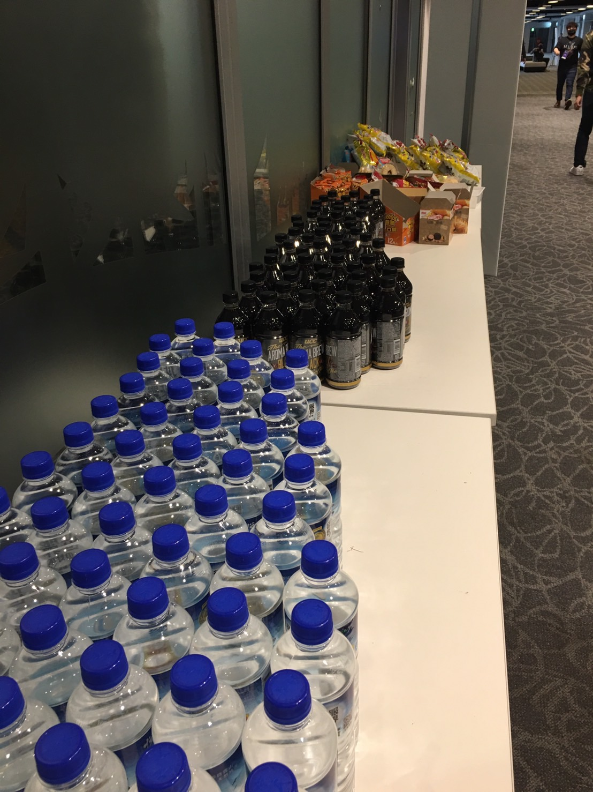
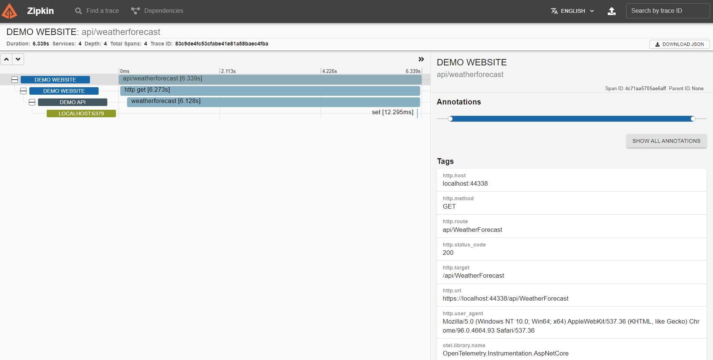
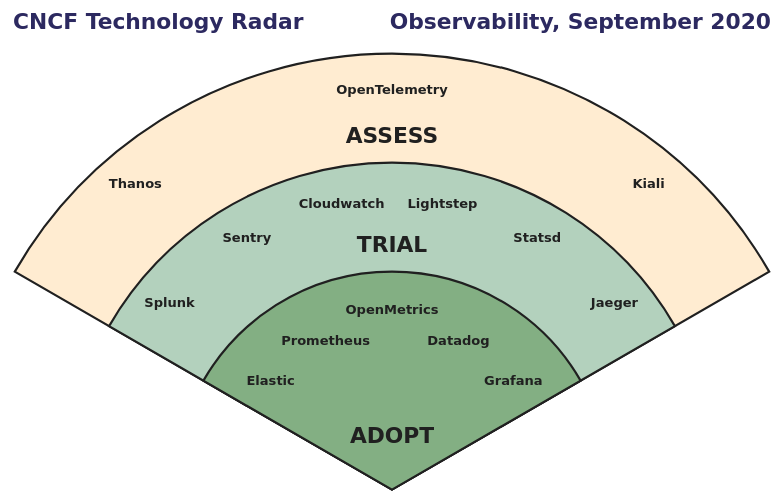
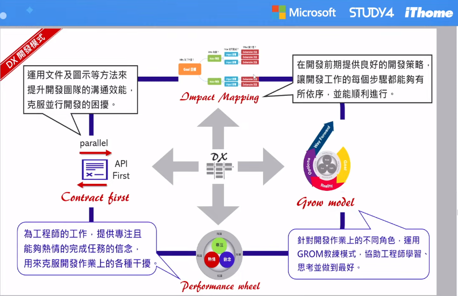

#### .Net Conf 簡易心得分享

| 9:30抵達已經快進不去了                      | 高朋滿座                     | 點心區｜
| ---------------------- | ---------------------- |----------|
|  |  ||

#### 參與議程

#### 1. ASP.NET Core 6.0 全新功能探索 - Will 保哥

- Program.cs、Startup.cs 統一為一個檔案
- 可直接使用 Configuration, Environment, WebHost 等等…，可以不用過度關注在 DI

Program.cs
```C#
var builder = WebApplication.CreateBuilder(args); 
// 處理依賴注入...
builder.WebHost.UseContentRoot(Directory.GetCurrentDirectory());
builder.WebHost.UseEnvironment(Environments.Staging);

builder.Services.AddControllersWithViews();
builder.Services.AddSingleton<IHelloService, HelloService>();

var app = builder.Build();

// Minimal Api...
var helloService = app.Services.GetRequiredService<IHelloService>();
app.MapGet("/", async context =>
{
    await context.Response.WriteAsync(helloService.HelloMessage);
});

app.Run();
```
- ASP.NET Core 啟動時預設使用 Kestrel
- Hot Reload 的陷阱
    - ViewBag 會因為 Dynamic 型別，Hot Reload 會炸開


#### 2. 初探 OpenTelemetry - 蒐集遙測數據的新標準 - Marcus Tung
- 名詞
    - Metrics 指標可看系統有甚麼狀況
    - Logs 有可察看的 Log
    - Traces reqeusts 處理緩慢、網路緩慢

- Monitoring & observabilty 差異
    - Monitoring：監控系統有無在工作
    - observabilty：可觀測系統為何沒在工作及可能出現的問題

##### 3. Opentelemetry：收集遙測數據資料的規範與標準
- tracing有上下文特性
- 一個還非常新的技術概念

##### zipkin 呈現 trace 的內容

##### 雲端監控技術雷達


- OpenTelemetry x .NET
APIs官方文件(https://opentelemetry.io/docs/instrumentation/net/)
講者Demo code(https://github.com/marcustung/OpenTelemetrySample)


#### 4. 十倍速開發效能的 DX 開發者體驗設計 - Ruddy Lee

- 何謂 DX
  UX for Developers，目的: 順暢和高品質的交付有用的價值、找出開發的最短路徑

- 績效輪
    - 專注
    - 熱情
    - 信念
    - …
    - …
    - 知識(最外層)
- 提升開發效能策略
    - 先解決需求
    - 影響地圖(impact mapping) -> user story -> 開發
- GROW 教練模式
    - 設定目標（Goal）
    - 掌握現狀（Reality）
    - 尋找方法（Options）
    - 意志力（Will）
##### 影響地圖 


##### 開發流程圖


#### 5. 微服務資料管理的天堂路 - CQRS / Event Sourcing 的應用與實踐 - Andrew Wu


#### 6. 深度學習的健達出奇蛋：要更小、更快，還得要更準 - 尹相志

- 用SSD模型架構做一個很輕量的口罩檢測Demo


